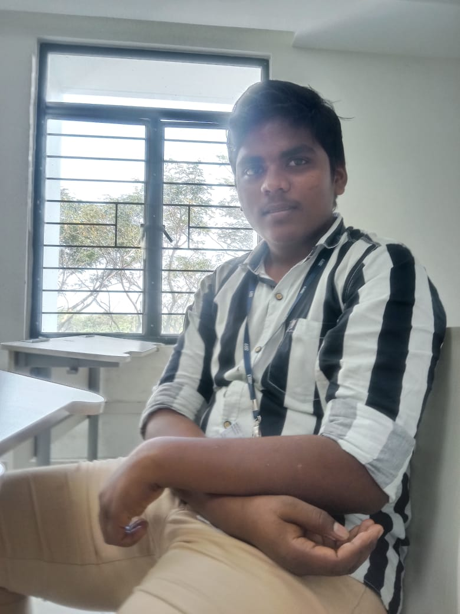
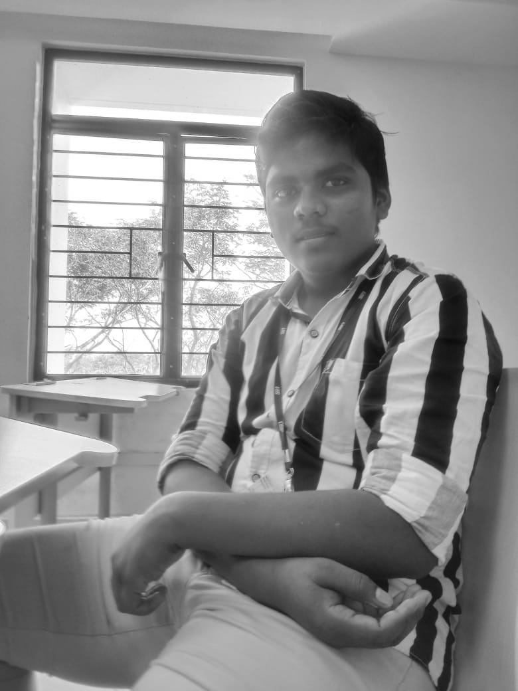
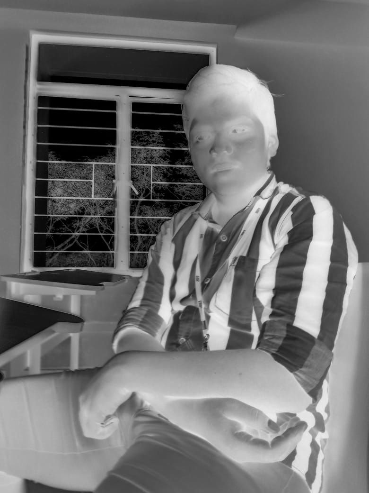
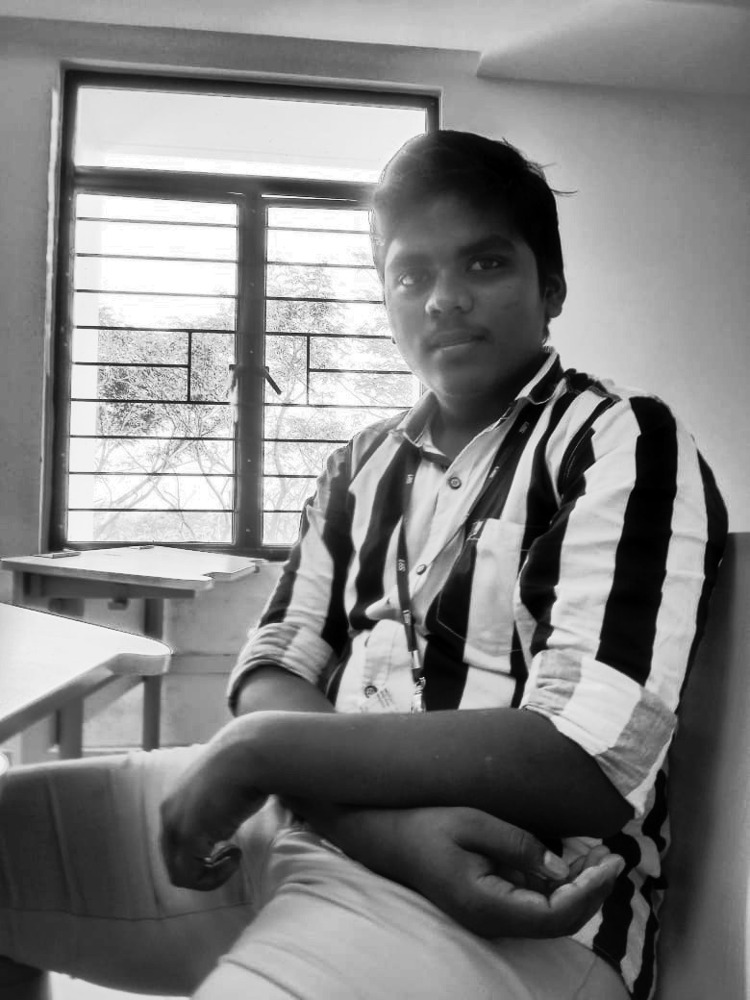

# Image Processing Pipeline 📸✨

## What's this about? 🤔

Yo! This is basically a sick image processing setup that takes your regular pics and transforms them into different vibes. We're talking grayscale conversions, negative effects, and histogram equalization - all the good stuff! 

No cap, checkout this  project

## The Glow Up Process 🔥

Our pipeline is pretty straightforward ngl:

1. **Original Image** → Drop your pics in the `inp/` folder
2. **Grayscale Conversion** → Gets converted and stored in `grey/` folder  
3. **Multiple Effects** → All the magic happens and results go to `out/` folder

## How to Run This Thing 🏃‍♂️

First, make sure you have all the dependencies installed:

```bash
pip install -r requirements.txt
```

Then just run the main file and watch this (●'◡'●):

```bash
python main.py
```

That's literally it. The code does all the work fr ✨

## The Transformation Journey 🎨

### Original Saravana Image
*Starting point - the OG pic*



### Step 1: Grayscale Conversion 🖤🤍
*When your pic goes monochrome and it's actually fire*



### Step 2: Negative Effect 🌚
*That dark academia aesthetic hits different*



### Step 2b: Histogram Equalization 📊
*Making those details pop like they're supposed to*



## Grayscale vs Histogram Equalized Comparison 📊

Let's see the real difference between basic grayscale and histogram equalized images side by side:

| **Grayscale** | **Histogram Equalized** |
|:-------------:|:------------------------:|
|  |  |
| *Basic monochrome conversion* | *Enhanced contrast and detail* |
| Good for simple processing | Better for analysis and clarity |
| Maintains original brightness distribution | Spreads brightness levels evenly |
| Fast and straightforward | More computational work but worth it |

**TL;DR:** Histogram equalization makes your images pop by redistributing the brightness levels. It's like adding contrast filter but scientifically! 🔬✨


## File Structure 📁

```
📂 Image Processing/
├── 📂 inp/           # Your original pics go here
│   └── saravana.jpg
├── 📂 grey/          # Grayscale versions (the in-between stage)
│   └── saravana_grayscale.jpg
├── 📂 out/           # Final processed images (the main character moment)
│   ├── saravana_negative.jpg
│   ├── saravana_hist_eq.jpg
│   └── saravana_negative_hist_eq.jpg
├── main.py           # The main character that runs everything
├── negative.py       # Creates those moody negative vibes
├── HistEqualization.py  # Makes your images crispy
├── grayscale_converter.py  # The monochrome specialist
└── requirements.txt  # All the dependencies you need (don't skip this!)
```

## What Each File Does 🤖

- **`main.py`** - ig you don't need explanation
- **`negative.py`** - Flips your image colors for that edgy aesthetic
- **`HistEqualization.py`** - Enhances contrast because we love dramatic lighting
- **`grayscale_converter.py`** - Removes colors but keeps the vibes intact

## Tech Stack 💻

- **OpenCV** - For all the image manipulation wizardry
- **Python** - Because it just works, periodt
- **Os module** - File handling made easy

## Pro Tips 💡

- Drop any image format in `inp/` - we support jpg, png, bmp, tiff (we're not picky)
- The folders get created automatically so don't stress about setup
- Each original image gets 4 different versions - variety is the spice of life fr

## Vibes Check ✅

This project is perfect for:
- Image processing Understaning
- Learning computer vision without the overwhelming technical docs
- Creating aesthetic variations of your pics

I plan to add more in the future, so keep supporting.......
---


*P.S. - If this helps you assignment, a star would be pretty cool ngl ⭐*
